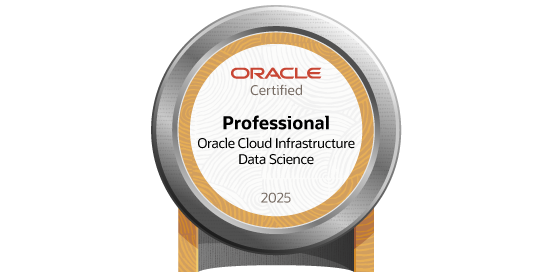
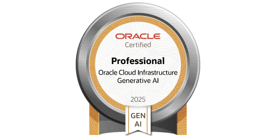

# 🎓 My Oracle Certification Portfolio

Welcome! This repository contains my [**Oracle**](https://www.oracle.com/) **certifications** from 2025, including badges and official certificates.  
*Click on each badge to see the full certificate and more details.*

## Certifications Summary

<a href="./data-science-professional/README.md" style="display:inline-block; margin:10px; text-align:center;">
  
   
  <strong>Data Science Professional</strong>
</a>

 
 

<a href="./generative-ai-professional/README.md" style="display:inline-block; margin:10px; text-align:center;">
  
   
  <strong>Generative AI Professional</strong>
</a>

 
 

<a href="./ai-foundations-associate/README.md" style="display:inline-block; margin:10px; text-align:center;">
  
   
  <strong>AI Foundations Associate</strong>
</a>

 
 

<a href="./oci-foundations-associate/README.md" style="display:inline-block; margin:10px; text-align:center;">
  
   
  <strong>OCI 2025 Foundations Associate</strong>
</a>

 
 

<a href="./fusion-ai-agent-studio-foundations-associate/README.md" style="display:inline-block; margin:10px; text-align:center;">
  
   
  <strong>AI Agent Foundations Associate</strong>
</a>

## Notes

- All badges link to their corresponding folder with **official certificates, and badges**. 

- Official Oracle documentation for the skills and competencies covered by each certification is available in the corresponding folder's `README.md`.  

- This portfolio is maintained to track my **progress and certifications** in Oracle programs and AI/Data Science tracks.

## *Special thanks* to:  
🕋🤲 **Almighty God** (ﷻ), for having given me intelligence and persistence to persevere.

Then:
- [**Oracle**](https://www.oracle.com/) for sponsoring the course and curating the course materials.
- [**Python community**](https://www.python.org/) for providing top-tier open-source libraries and resources.

    

