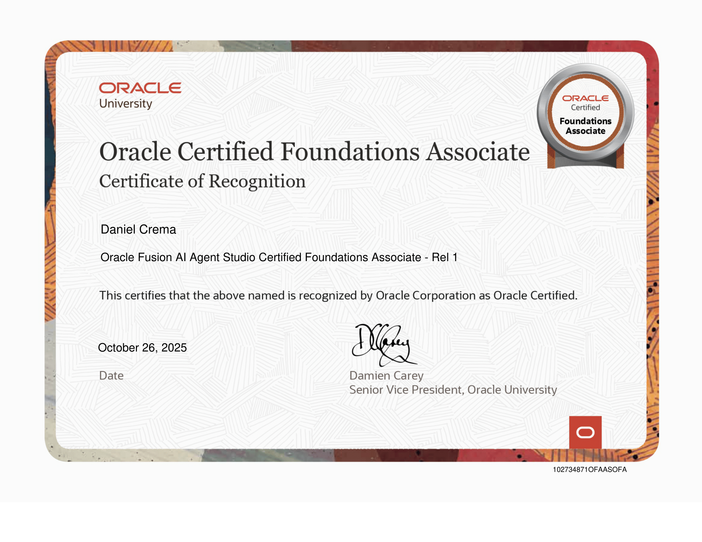

# Oracle Fusion AI Agent Studio Certified Foundations Associate 🎓

 

  

 
 

### 🌍🌎🌏 Multi-Language for your convenience

This folder contains the **official certificate** and **digital badge** issued by [**Oracle**](https://www.oracle.com/).  
*For more details about the **skills and knowledge areas** covered by this certification, click the badge above.*

---

Esta pasta contém o **certificado oficial** e a **badge digital** emitidos pela [**Oracle**](https://www.oracle.com/).  
*Para mais informações sobre as **competências e conhecimentos** associados a esta certificação, clique na badge acima.*

---

Esta carpeta contiene el **certificado oficial** y la **insignia digital** emitidos por [**Oracle**](https://www.oracle.com/).  
*Para obtener más información sobre las **competencias y conocimientos** relacionados con esta certificación, haz clic en la insignia de arriba.*

 

## Certificate

    

 

## *Special thanks* to:  
🕋🤲 **Almighty God** (ﷻ), for having given me intelligence and persistence to persevere.

Then:
- [**Oracle**](https://www.oracle.com/) for sponsoring the course and curating the course materials.
- [**Python community**](https://www.python.org/) for providing top-tier open-source libraries and resources.

    

